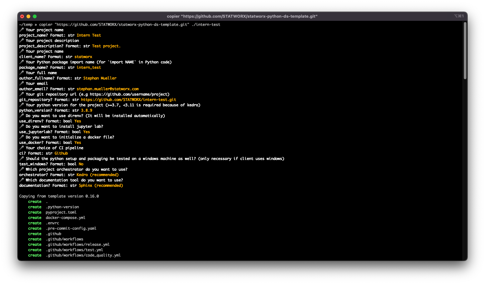

### Step-by-step project initialisation
The following is a step-by-step tutorial to initialising a new project using the copier template.

You need [copier](https://copier.readthedocs.io/en/latest) with version `>=6.0.0a1` to create this project. This is a **hard** requirement as other versions will not work. It is recommended that you install the module with the following command:

`/bin/bash -c "$(curl -fsSL https://raw.githubusercontent.com/STATWORX/statworx-python-ds-template/master/install_copier.sh)"`

Then run:

`copier "https://github.com/STATWORX/statworx-python-ds-template.git" /path/to/your/new/project`

You will next be guided through the project settings.

If you are not using a git repository, you can skip the next section.
The next step is to commit the project to git using commitizen and push the initial project setup. For this, execute the following commands:
- `git add .` to stage all files.
- `cz commit` to commit the changes. Here, as described below in further detail, you will be prompted to supply tags and a commit message.
- `git push --set-upstream origin branch_name`, where `branch_name`  usually equates to *main* or *master*. This sets the required reference for the upstream branch.

From here you have an initial setup that is available both locally and on github.

For project members or contributors joining the project, the first step after cloning the repository is to install the required dependencies. This can be accomplished by running `make install` from the project root.